# TKD — Technical Knowledge Document
## Korean ↔ English Real-Time Translation Service

**Version**: 1.0  
**Last Updated**: 2026-02-21  
**Purpose**: Deep technical reference for understanding how every component works under the hood. This is the "why" and "how it works" companion to the TRD (which is the "what to build").

---

## Table of Contents

1. [Why Korean Is Hard for ASR](#1-why-korean-is-hard-for-asr)
2. [Streaming ASR Architecture](#2-streaming-asr-architecture)
3. [Beam Search & Decoding](#3-beam-search--decoding)
4. [Endpointing & Silence Detection](#4-endpointing--silence-detection)
5. [Transport Protocols: WebSocket vs gRPC](#5-transport-protocols-websocket-vs-grpc)
6. [ASR Provider Deep Dive](#6-asr-provider-deep-dive)
7. [Audio Capture Pipeline](#7-audio-capture-pipeline)
8. [Interim vs Final Result Handling](#8-interim-vs-final-result-handling)
9. [Translation Architecture](#9-translation-architecture)
10. [Qwen3-ASR Self-Hosted ASR Engine](#10-qwen3-asr-self-hosted-asr-engine)
11. [Local Translation Models](#11-local-translation-models)
12. [Qwen3-ASR on Apple Silicon (MLX)](#12-qwen3-asr-on-apple-silicon-mlx)
13. [Error Metrics: WER vs CER](#13-error-metrics-wer-vs-cer)
14. [Provider Benchmark Data](#14-provider-benchmark-data)
15. [Cost Analysis](#15-cost-analysis)

---

## 1. Why Korean Is Hard for ASR

### 1.1 SOV (Subject-Object-Verb) Sentence Structure

Korean is fundamentally different from English (SVO). Meaning, tense, negation, and politeness are all determined at the **end** of a sentence.

```
English (SVO):  I      ate      rice
                Subj   Verb     Obj     ← meaning clear after "ate"

Korean  (SOV):  나는    밥을     먹었습니다
                Subj   Obj      Verb    ← meaning clear only at "먹었습니다"
```

This means **static chunking destroys Korean**. If you split audio into fixed 3-second windows:

```
Chunk 1: "나는 밥을..."     → translates to "I rice..." (meaningless)
Chunk 2: "먹었습니다"        → translates to "ate" (orphaned verb)
```

Streaming ASR with progressive refinement solves this because the model maintains continuous state across the entire utterance.

### 1.2 Agglutinative Morphology

Korean builds meaning by stacking suffixes onto word stems:

```
먹다       → to eat (dictionary form)
먹었       → ate (past tense)
먹었습     → ate (past + formal)
먹었습니다  → ate (past + formal + polite declarative)
먹었습니까  → did [you] eat? (past + formal + polite interrogative)
```

A single character change at the end flips statement to question. The ASR model must hear the complete suffix chain before committing.

### 1.3 Sentence-Ending Particles

Korean particles at the end determine tone and intent:

| Ending | Meaning | Register |
|--------|---------|----------|
| ~요 | polite informal | Everyday conversation |
| ~습니다/~ㅂ니다 | polite formal | Business, presentations |
| ~야/~이야 | casual | Friends, children |
| ~거든요 | explanatory | "The thing is..." |
| ~잖아요 | "you know" / shared knowledge | Casual reminder |
| ~네요 | surprise/realization | "Oh, I see!" |

Missing these endings produces wrong translations with wrong tone.

### 1.4 Filler Words and Pauses

Korean speakers frequently use fillers mid-sentence:

```
"그..."        → "um..."
"그러니까..."   → "so, I mean..."
"음..."        → "hmm..."
"있잖아..."     → "you know..."
```

Static chunking often splits at these pause points, producing incomplete chunks. Streaming ASR treats these as continuations within the same utterance because its language model knows fillers are followed by more speech.

### 1.5 Spacing Ambiguity

Korean spacing is inconsistent even among native speakers:

```
"나는 학교에 갔다"   (with spaces — standard)
"나는학교에갔다"      (no spaces — also valid/common)
```

This is why Korean ASR uses **Character Error Rate (CER)** not Word Error Rate (WER) — word boundaries are ambiguous.

---

## 2. Streaming ASR Architecture

### 2.1 The Complete Pipeline

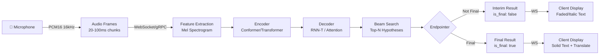

### 2.2 Feature Extraction: Mel Spectrogram

Raw audio is converted into a visual representation of frequency content over time:

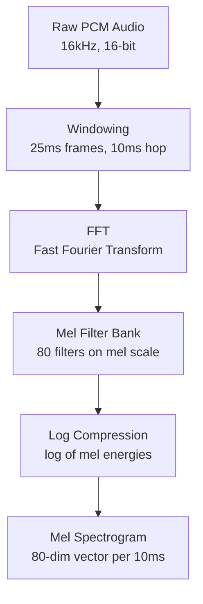

**Why Mel scale?** Human hearing perceives pitch logarithmically — the difference between 100Hz and 200Hz sounds the same as 1000Hz and 2000Hz. Mel scale compresses frequencies to match human perception, giving the model features that correspond to how we actually hear.

**Frame math**: At 16kHz sample rate with 25ms windows and 10ms hop:
- 1 second of audio → 100 feature frames
- Each frame = 80-dimensional vector
- 10 seconds of audio → 1000 frames × 80 dimensions

### 2.3 Encoder: Conformer Architecture

The encoder converts mel spectrogram frames into high-level acoustic representations:

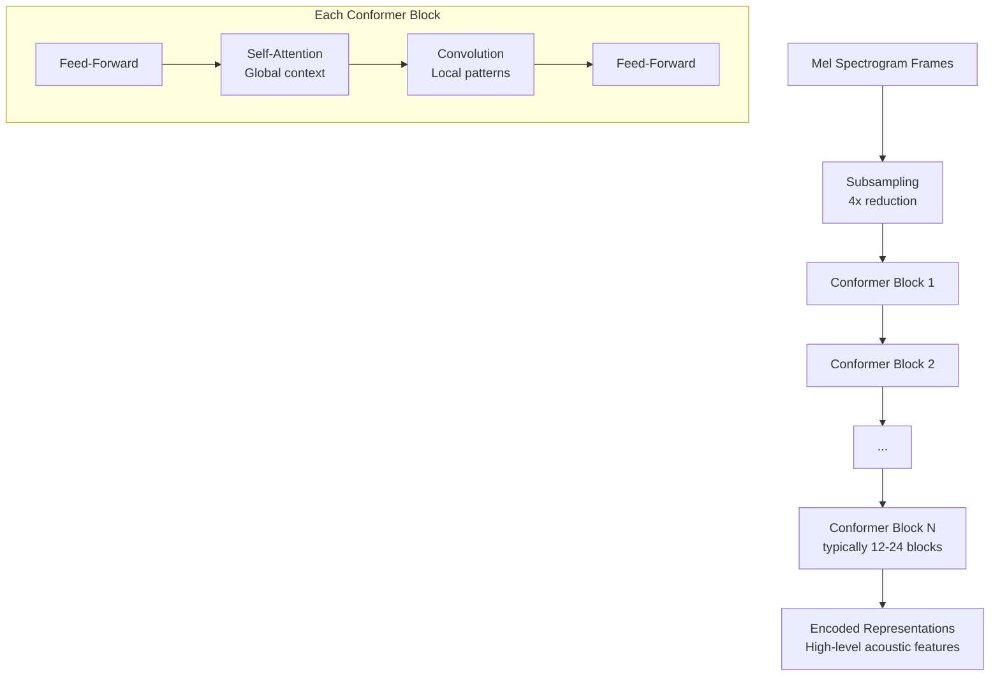

**Why Conformer over pure Transformer?** The Conformer combines self-attention (captures global context — how sounds relate across the whole utterance) with convolution (captures local patterns — phoneme-level acoustic features). This dual approach consistently outperforms either architecture alone for speech.

**Subsampling**: The first layer reduces temporal resolution by 4x. A 10-second audio that produced 1000 mel frames becomes 250 encoder frames. This makes the model faster without losing important information because adjacent audio frames are highly redundant.

### 2.4 Decoder: RNN-T (Recurrent Neural Network Transducer)

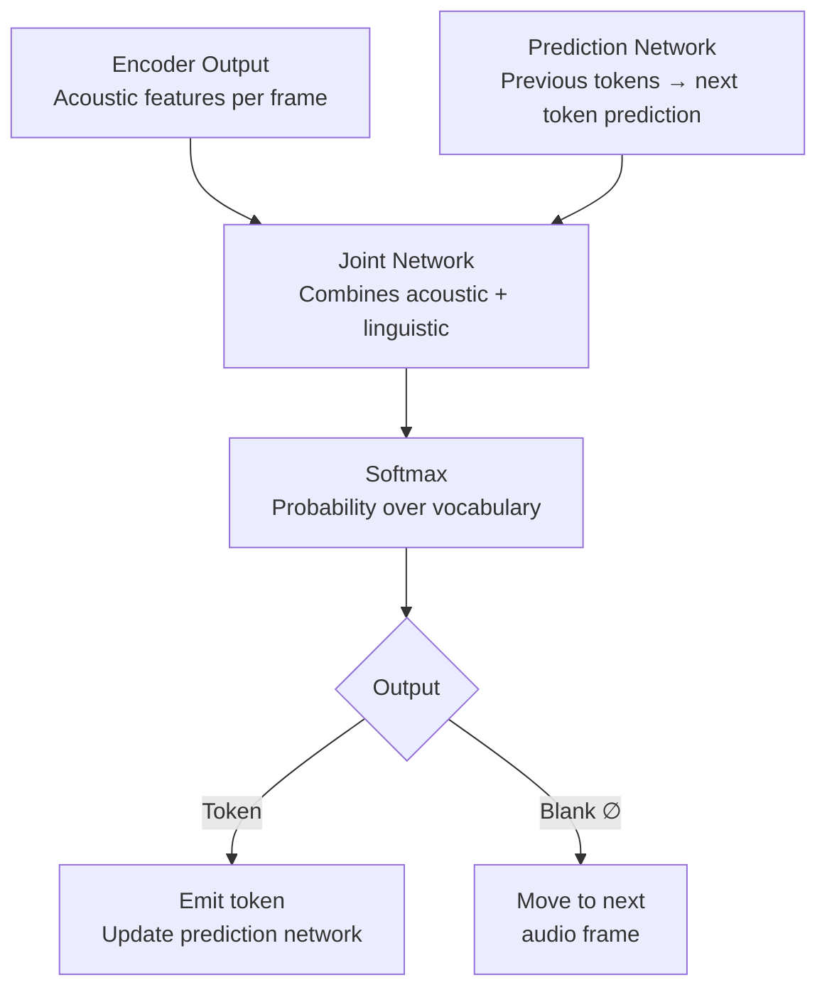

**RNN-T is the key to streaming**. Unlike attention-based decoders (which need the full utterance), RNN-T processes one audio frame at a time and decides: "emit a token" or "blank (wait for more audio)."

The **Prediction Network** is essentially a language model — it maintains a hidden state of all previously emitted tokens and predicts what should come next. This is what allows the model to know that after "안녕하" the next likely sequence is "세요" even before hearing the audio clearly.

The **Joint Network** combines the acoustic evidence (encoder) with the linguistic prediction (prediction network) to make the final decision. When both agree, confidence is high and a token is emitted.

---

## 3. Beam Search & Decoding

### 3.1 How Beam Search Works

Beam search keeps the **top N** (beam width) candidate sequences alive at each step, rather than greedily picking only the best one.

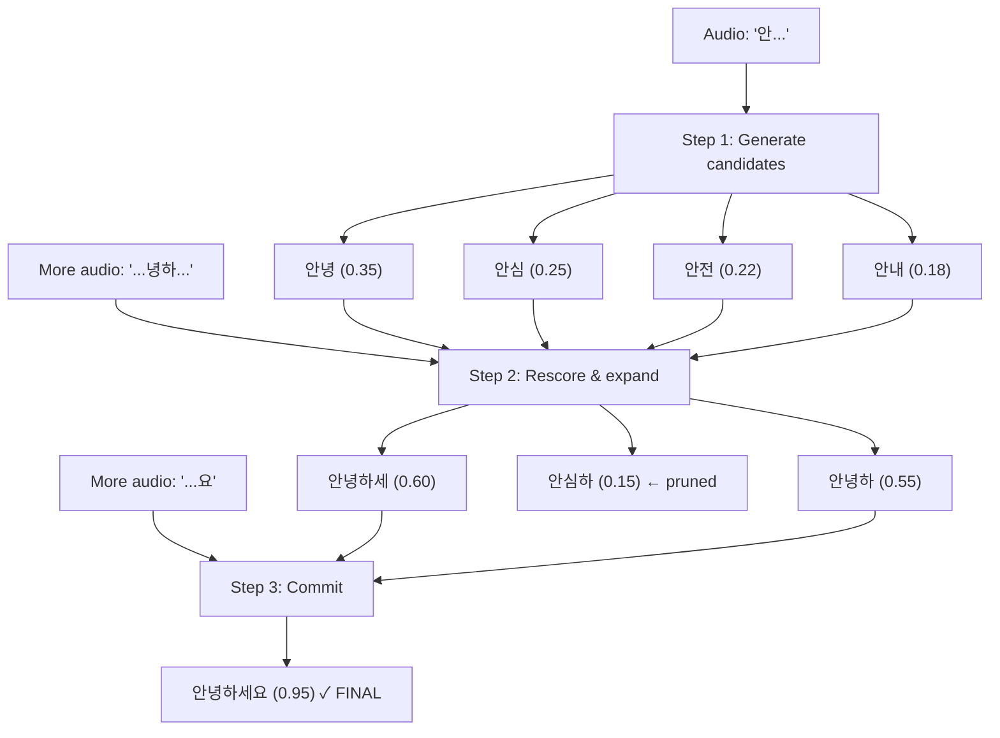

### 3.2 Why Not Greedy Decoding?

Greedy decoding picks the single best token at each step. This fails for Korean because:

```
Audio: "안녕하세요" (Hello - formal)

Greedy path:   안 → 안녕 → 안녕하 → 안녕하세 → 안녕하세요 ✓
               (happens to work here)

Audio: "안심하세요" (Please relax)

Greedy at step 1: 안녕 (0.35) > 안심 (0.25) ← wrong choice!
Greedy path:      안녕... → stuck, must backtrack
Beam search:      keeps both "안녕" and "안심" alive → rescores → "안심" wins
```

Beam search avoids committing too early. With Korean's agglutinative structure, early commitment is especially dangerous.

### 3.3 Beam Width Trade-offs

| Beam Width | Accuracy | Speed | Memory | Use Case |
|-----------|----------|-------|--------|----------|
| 1 (greedy) | Lowest | Fastest | Minimal | Not suitable for Korean |
| 4 | Good | Fast | Low | Real-time streaming (typical) |
| 8 | Better | Moderate | Moderate | Balanced accuracy/speed |
| 16 | Best | Slower | Higher | Offline/batch processing |

All three cloud providers (Google, Deepgram, OpenAI) use beam width 4-8 for their streaming endpoints. Not configurable by the user.

---

## 4. Endpointing & Silence Detection

### 4.1 What Triggers a "Final" Result

The endpointer runs server-side within the ASR provider. It combines three signals:

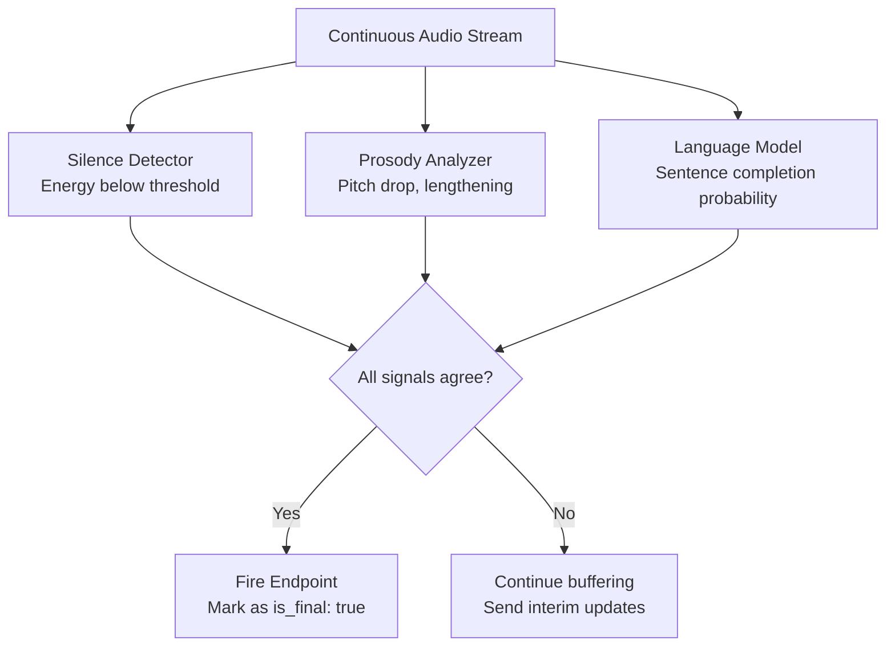

**Signal 1 — Silence Duration**: Typically 300-800ms of silence. But silence alone is unreliable — Korean speakers pause mid-sentence frequently (filler words).

**Signal 2 — Prosody Changes**: Falling pitch at end of declarative sentences. Rising pitch at end of questions. Vowel lengthening before pauses. These acoustic cues help distinguish "thinking pause" from "sentence done."

**Signal 3 — Linguistic Probability**: The language model within the decoder assigns probabilities. When it sees sentence-ending particles (요, 다, 니다, 까), the probability of "sentence complete" spikes. Combined with silence, this is the strongest signal.

### 4.2 Korean-Specific Endpointing Challenges

```
"저는... 음... 그러니까... 학교에 갔습니다"
 I...    um...  so...       went to school

 ↑ pause  ↑ pause  ↑ pause       ↑ actual end
```

Naive silence-only detection would fire endpoints at each pause, producing four fragments instead of one sentence. The language model prevents this because:
- After "저는" (I + topic marker), sentence is incomplete (no verb)
- After "음" (filler), same — no verb yet
- After "그러니까" (so/I mean), still waiting for main clause
- After "갔습니다" (went + formal ending), sentence is grammatically complete → endpoint fires

### 4.3 Lookahead Buffering

The encoder's attention mechanism naturally looks ahead a few hundred milliseconds before committing to earlier frames. This is **inherent latency**, not a configurable parameter:

```
Audio timeline:   |---300ms---|---300ms---|---300ms---|
Encoding:               ↑
                   Attention looks at this window
                   before committing output for this point
```

Typical inherent latency: 200-400ms. This is the fundamental reason real-time ASR can never be zero-latency — the model needs future context to accurately decode current audio.

---

## 5. Transport Protocols: WebSocket vs gRPC

### 5.1 Protocol Comparison

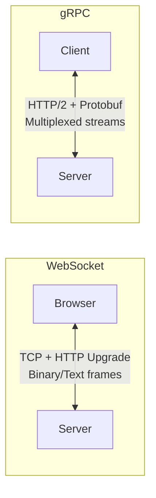

| Feature | WebSocket | gRPC |
|---------|-----------|------|
| Protocol | TCP + HTTP/1.1 upgrade | HTTP/2 |
| Serialization | JSON or binary | Protocol Buffers (binary) |
| Browser native | ✅ Yes | ❌ No (needs proxy) |
| Bidirectional | ✅ Yes | ✅ Yes |
| Multiplexing | ❌ One stream per connection | ✅ Multiple streams per connection |
| Type safety | ❌ Manual | ✅ Generated from .proto files |
| Overhead per message | ~2-6 bytes frame header | ~5 bytes + protobuf overhead |
| Practical throughput | Equivalent for audio streaming | Equivalent for audio streaming |

### 5.2 Why Google Uses gRPC

Google's Cloud Speech-to-Text API is built on gRPC because Google invented both gRPC and Protocol Buffers. Their entire infrastructure uses it internally. The `StreamingRecognize` RPC is a bidirectional stream:

```protobuf
service Speech {
  rpc StreamingRecognize(stream StreamingRecognizeRequest) 
      returns (stream StreamingRecognizeResponse);
}
```

**Browser impact**: gRPC cannot run directly in browsers (HTTP/2 trailers not supported). Our server must act as a **proxy**: browser → WebSocket → our server → gRPC → Google.

### 5.3 Why Deepgram and OpenAI Use WebSocket

Browser-friendly. No proxy needed. For audio streaming use cases, WebSocket's simplicity wins — there's no meaningful performance advantage to gRPC when you're sending 20ms audio frames.

### 5.4 Our Architecture's Transport Layer

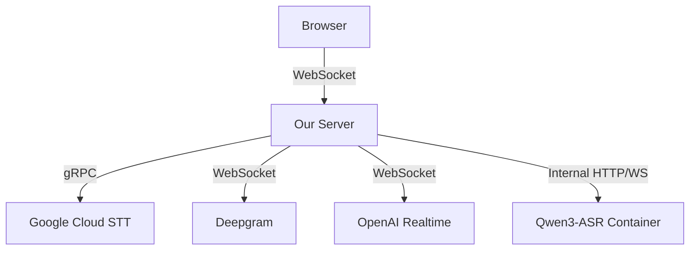

The SDK always connects to our server via WebSocket. The server handles upstream protocol differences transparently. This is a key architectural benefit — the SDK is provider-agnostic.

---

## 6. ASR Provider Deep Dive

### 6.1 Google Cloud Speech-to-Text

**Model Architecture**: Chirp (Universal Speech Model - USM)
- 2B parameter encoder trained on 12M hours of audio across 100+ languages
- Korean is a first-class language (YouTube, Android, Google Assistant all use it)
- Chirp 2 is current production; Chirp 3 is latest generation

**Streaming API**: `StreamingRecognize` via gRPC
- Sends `StreamingRecognizeRequest` with audio chunks
- Receives `StreamingRecognizeResponse` with results array
- Each result has `is_final` boolean and `alternatives` with `transcript` + `confidence`
- Supports `interim_results: true` for progressive display

**Korean Configuration**:
```
language_code: "ko-KR"
model: "chirp_2"  (or "latest_long" for streaming)
encoding: LINEAR16
sample_rate_hertz: 16000
enable_automatic_punctuation: true
```

**Billing**: $0.016/15-second increment. A 60-minute session = ~$3.84

### 6.2 Deepgram

**Model Architecture**: Nova-3
- Proprietary end-to-end model
- Korean added Q1 2025 with Nova-3 release
- Claims 27% WER improvement over Nova-2 for Korean

**Streaming API**: WebSocket to `wss://api.deepgram.com/v1/listen`
- Audio sent as raw binary frames
- Responses as JSON with `channel.alternatives[0].transcript` and `is_final`

**Korean Configuration**:
```
model=nova-3
language=ko
interim_results=true
punctuate=true
endpointing=300  (ms silence threshold, adjustable)
```

**Billing**: $0.0046/second streaming. A 60-minute session = ~$0.28

### 6.3 OpenAI Realtime API

**Model Architecture**: GPT-4o Transcribe
- Multimodal model with native audio understanding
- Not traditional ASR — processes audio as a modality alongside text
- Korean training data smaller than Google's but growing

**Streaming API**: WebSocket to `wss://api.openai.com/v1/realtime?intent=transcription`
- Audio sent as base64-encoded PCM16 in JSON wrappers
- Uses server-side VAD (Voice Activity Detection) for turn detection
- Responses: `conversation.item.input_audio_transcription.delta` (interim) and `.completed` (final)

**Authentication**: Requires ephemeral key:
```
POST /v1/realtime/client_secrets
→ { client_secret: { value: "ek_...", expires_at: 1234567890 } }
```

**Korean Configuration**:
```json
{
  "type": "transcription_session.update",
  "input_audio_format": "pcm16",
  "input_audio_transcription": {
    "model": "gpt-4o-transcribe",
    "language": "ko"
  },
  "turn_detection": {
    "type": "server_vad",
    "threshold": 0.5,
    "silence_duration_ms": 500
  }
}
```

**Billing**: ~$0.006/minute (audio input tokens + output tokens). A 60-minute session = ~$0.36

### 6.4 Qwen3-ASR (Self-Hosted)

**Why Qwen3-ASR over NeMo for Korean:**
- NeMo has no pretrained Korean streaming model — requires weeks of fine-tuning on KsponSpeech data
- Qwen3-ASR supports Korean natively (one of 11 core languages) with zero fine-tuning
- Qwen3-ASR achieves SOTA among open-source ASR, competitive with Google and OpenAI commercial APIs
- vLLM serving is simpler than Triton Inference Server
- Context biasing (feed domain terms to improve accuracy) is unique to Qwen3-ASR
- Also available in 0.6B for cost-sensitive deployments (2000x throughput at concurrency 128)

**Model Architecture**: Qwen3-ASR-1.7B
- Built on Qwen3-Omni foundation model by Alibaba
- 1.7B parameters, trained on massive multilingual speech data
- Native Korean support (one of 11 core languages, 30 total)
- SOTA among open-source ASR models, competitive with proprietary APIs
- Unified streaming/offline via dynamic attention window mechanism

**Streaming Mechanism**:
Unlike NeMo's cache-aware chunking, Qwen3-ASR uses a dynamic attention window that naturally supports streaming. Audio is processed in 2-second chunks with a 5-token fallback, keeping the last four chunks unfixed for refinement. This achieves streaming inference with a single model that also works offline.

**Context Biasing**:
A unique feature — feed domain-specific text (keywords, jargon, background paragraphs) to bias recognition without retraining. Useful for technical domains.

**VRAM Requirements**:
| Model | Parameters | VRAM (Inference) | Throughput |
|-------|-----------|------------------|-----------|
| Qwen3-ASR-0.6B | 600M | ~2-4 GB | 2000x at concurrency 128 |
| **Qwen3-ASR-1.7B (default)** | **1.7B** | **~4-6 GB** | **High (vLLM optimized)** |

---

## 7. Audio Capture Pipeline

### 7.1 Browser Audio API Flow

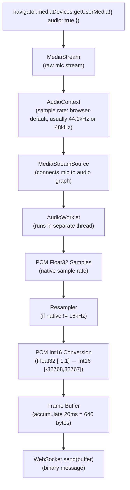

### 7.2 Why AudioWorklet Over ScriptProcessorNode

`ScriptProcessorNode` runs on the main thread and is deprecated. It causes audio glitches under CPU load because JavaScript execution competes with audio processing.

`AudioWorklet` runs in a **separate audio rendering thread** with guaranteed real-time scheduling. It processes audio buffers (typically 128 samples) with consistent timing regardless of main thread activity.

### 7.3 Resampling

Browsers typically capture at 44.1kHz or 48kHz, but ASR models expect 16kHz. Downsampling is required:

```
44100 Hz → 16000 Hz (ratio: 2.75625:1)
48000 Hz → 16000 Hz (ratio: 3:1)
```

**Implementation**: Linear interpolation or polyphase filter in the AudioWorklet. Libraries like `libsamplerate` (compiled to WASM) provide high-quality resampling, but for speech, simple linear interpolation is sufficient.

### 7.4 PCM16 Encoding

ASR providers expect signed 16-bit integer PCM:

```javascript
// Float32 [-1.0, 1.0] → Int16 [-32768, 32767]
function floatToInt16(float32Array) {
  const int16Array = new Int16Array(float32Array.length);
  for (let i = 0; i < float32Array.length; i++) {
    const s = Math.max(-1, Math.min(1, float32Array[i]));
    int16Array[i] = s < 0 ? s * 0x8000 : s * 0x7FFF;
  }
  return int16Array;
}
```

### 7.5 Frame Size Math

```
Sample rate: 16,000 Hz
Bit depth: 16 bits = 2 bytes per sample
Frame duration: 20ms

Samples per frame: 16000 × 0.020 = 320 samples
Bytes per frame: 320 × 2 = 640 bytes

Bandwidth: 640 bytes × 50 frames/sec = 32,000 bytes/sec = 256 kbps
```

This is the raw uncompressed bandwidth. Some providers accept Opus or FLAC for lower bandwidth, but PCM16 is universally supported and avoids encoding/decoding latency.

---

## 8. Interim vs Final Result Handling

### 8.1 The Two-Buffer Pattern

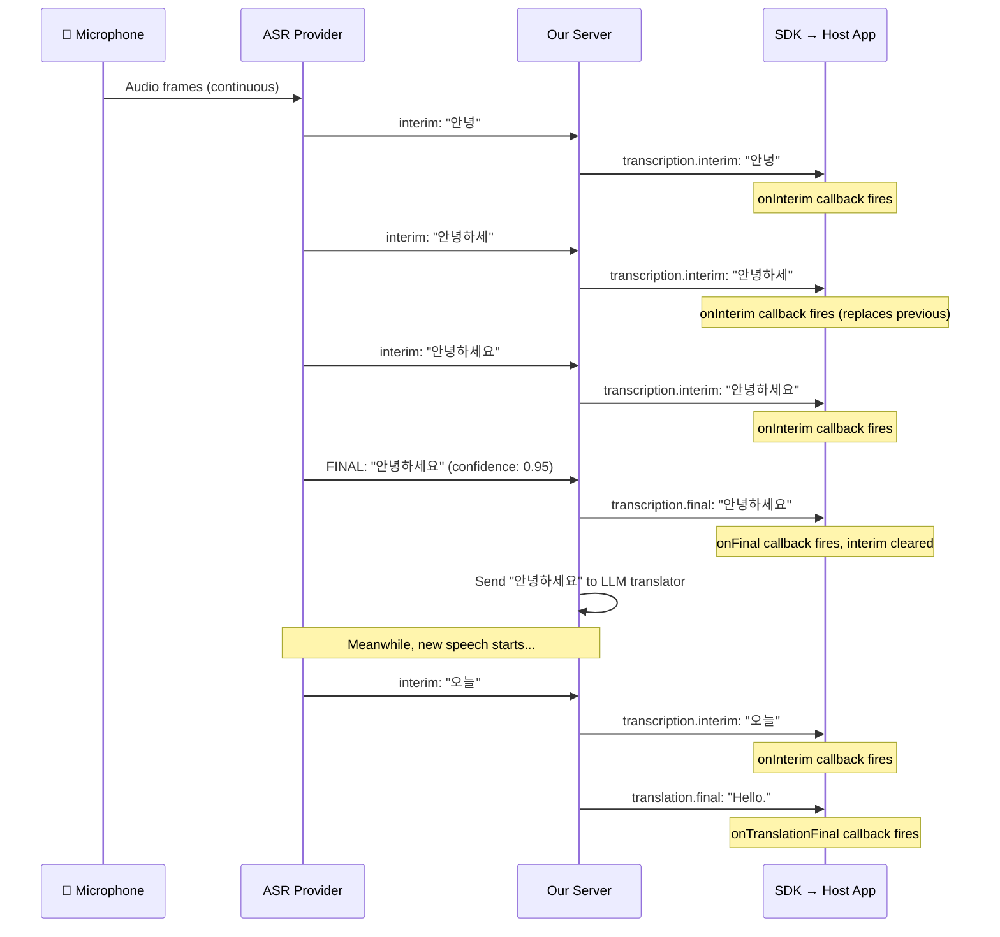

### 8.2 SDK Internal State Management

The SDK maintains this internal state and exposes it via accessors + callbacks. The host app uses these to render its own UI.

```
SDK Internal State:
  finalSentences: []          ← committed Korean sentences
  translations: {}            ← { sentenceIndex: englishText }
  currentInterim: ""          ← latest interim hypothesis (single string, replaced each time)

On interim received:
  currentInterim = result.text    ← just overwrite, don't accumulate
  fire onTranscriptionInterim callback

On final received:
  finalSentences.push(result.text)
  currentInterim = ""             ← clear interim, new sentence starts fresh
  fire onTranscriptionFinal callback
  (server triggers translation independently)

On translation received:
  translations[sentenceIndex] = translatedText
  fire onTranslationFinal callback
```

**Host app reads state via:**
- `translator.getTranscript()` → `{ finals: string[], currentInterim: string }`
- `translator.getTranslations()` → `{ [index: number]: string }`
- Or via event callbacks for reactive rendering

**Critical rule**: Interim results are **disposable**. Never translate interim in `final-only` mode. Never accumulate interims — each new interim replaces the previous one entirely.

### 8.3 Hybrid Mode: Interim Translation

In `hybrid` mode, the server sends interim Korean text to NMT for fast preview translation:

```
Interim Korean: "오늘 날씨가"
  → NMT (Google Translate, ~100ms): "Today the weather"
  → Display as faded English

Final Korean: "오늘 날씨가 좋네요"
  → LLM (~300-500ms): "The weather is lovely today."
  → Display as solid English, replacing the interim translation
```

This gives users instant visual feedback while waiting for the higher-quality LLM translation.

---

## 9. Translation Architecture

### 9.1 NMT vs LLM Comparison

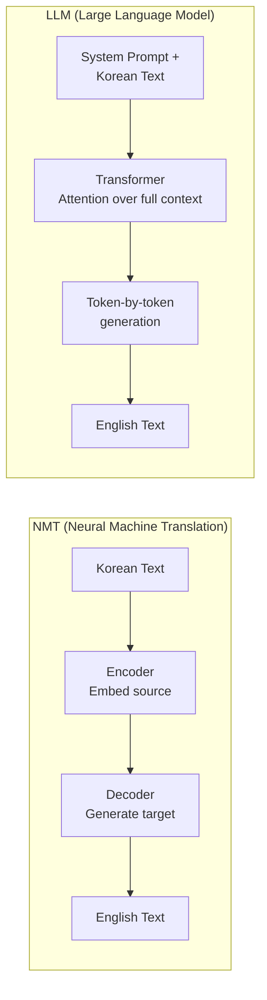

| Dimension | NMT (Google Translate) | LLM (Claude / Google Translation LLM) |
|-----------|----------------------|---------------------------------------|
| Architecture | Dedicated encoder-decoder, trained only on parallel corpora | General-purpose transformer, translation is one of many capabilities |
| Latency | ~100-200ms | ~300-1500ms |
| Cost per 1M chars | ~$20 | ~$100-500 (varies by model) |
| Korean formality | Basic — often loses 반말/존댓말 distinction | Excellent — can preserve register with prompting |
| Idioms | Literal translations common | Understands cultural context |
| Context window | Sentence-level only | Can see previous sentences for coherence |
| Example | "밥 먹었어?" → "Did you eat rice?" | "밥 먹었어?" → "Have you eaten?" (understanding it's a greeting) |

### 9.2 Korean Translation Challenges

**Example 1: Formality registers**
```
반말 (casual):  "밥 먹었어?"
NMT:            "Did you eat rice?"
LLM:            "Have you eaten?" (recognizes this is a common Korean greeting)

존댓말 (formal): "식사하셨습니까?"
NMT:            "Did you have a meal?"
LLM:            "Have you had your meal, sir/ma'am?"
```

**Example 2: Implied subjects**
```
Korean:  "갔다 왔어요"  (literally: "went came" — no subject)
NMT:     "I went and came back." (assumes first person)
LLM:     "I'm back." or "They've returned." (can infer from context)
```

**Example 3: Cultural idioms**
```
Korean:  "눈치가 빠르다"  (literally: "eye-measure is fast")
NMT:     "Your eyesight is fast."
LLM:     "You're quick to read the room."
```

### 9.3 LLM Translation Provider Options

**Google Cloud Translation LLM**
- Purpose-built for translation, not a general LLM
- ~3x faster than Gemini, higher quality than NMT
- Best balance of speed/quality for real-time use
- Access via Cloud Translation API v3

**Claude (Anthropic)**
- Highest overall translation quality (WMT24: first in 9/11 language pairs)
- Best at preserving tone, nuance, cultural context
- Slower (~500-1500ms) — may not suit real-time for every use case
- Best used when quality matters more than speed

**Qwen (Alibaba)**
- Specifically trained on CJK languages
- Strong Korean technical vocabulary
- Open-weight — can self-host for cost savings
- Worth benchmarking against Google Translation LLM for Korean specifically

### 9.4 Translation Flow Decision Tree

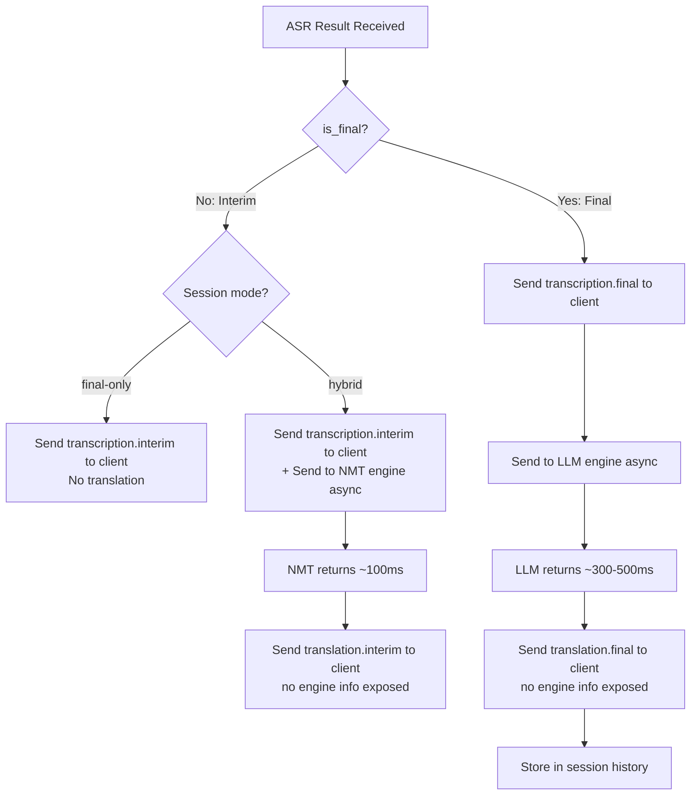

---

## 10. Qwen3-ASR Self-Hosted ASR Engine

### 10.1 Architecture Overview

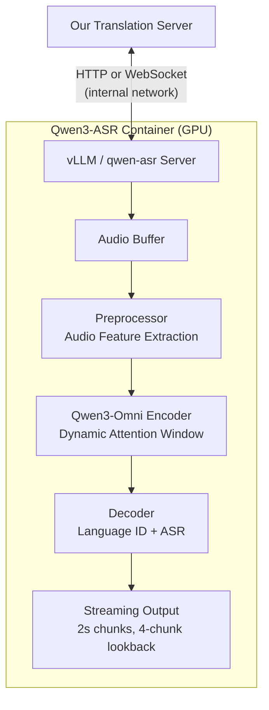

### 10.2 Streaming Mechanism

Qwen3-ASR uses a dynamic attention window for streaming, different from NeMo's cache-aware approach:

```
NeMo approach:  Explicitly save/restore encoder attention cache per chunk
Qwen3-ASR:      Dynamic attention window — model natively processes chunks
                 with unfixed lookback (last 4 chunks can be revised)
```

Streaming config: 2-second chunk size, 5-token fallback, last 4 chunks unfixed. This means the model can revise its output for the last ~8 seconds of audio as new audio arrives — similar to how cloud providers emit interim results that get refined.

### 10.3 Context Biasing

Qwen3-ASR accepts arbitrary context text to bias recognition. This is invaluable for domain-specific use:

```python
# Example: biasing toward Korean technical terms
context = "인공지능 머신러닝 딥러닝 자연어처리 트랜스포머"
# Feed context alongside audio to improve recognition of these terms
```

Supported formats: keyword lists, full paragraphs, mixed text of any length. No preprocessing needed — the model handles it internally.

### 10.4 Language Detection

Qwen3-ASR automatically identifies the spoken language before transcription. For our use case (Korean → English), this means:
- No need to specify `language: 'ko'` — model auto-detects
- Handles code-switching (Korean mixed with English words) gracefully
- Can distinguish between Korean and other CJK languages

---

## 11. Local Translation Models

### 11.1 Qwen3-30B-A3B for Translation

Qwen3-30B-A3B is a Mixture-of-Experts (MoE) model from Alibaba's Qwen3 family. It has 30B total parameters but only 3B active per inference — meaning it runs fast with low resource usage while having the knowledge capacity of a much larger model.

**Architecture:**
- Total parameters: 30B
- Active parameters: 3B (128 experts, 8 active per token)
- Context length: 128K tokens
- Architecture: GQA (32 Q heads, 4 KV heads), RoPE, RMS Norm
- License: Apache 2.0

**Korean→English Translation Quality:**
- Supports 100+ languages including Korean
- Strong multilingual translation and instruction following
- Quality comparable to or better than Qwen2.5-72B on many benchmarks despite 10x fewer active params
- Preserves formality register (반말/존댓말) when prompted correctly

**System Requirements:**

| Platform | Hardware | RAM/VRAM | Expected Speed |
|----------|----------|----------|----------------|
| Apple Silicon M1 | 16GB+ RAM | ~8GB used | ~8-10 TPS |
| Apple Silicon M2/M3 | 16GB+ RAM | ~8GB used | ~10-13 TPS |
| Apple Silicon M4 Max | 128GB RAM | ~8GB used | ~13 TPS |
| NVIDIA T4 | 16GB VRAM | ~8GB used | ~15-20 TPS |
| NVIDIA A10 | 24GB VRAM | ~8GB used | ~25-35 TPS |

**Serving:**
- GPU: vLLM (`vllm serve Qwen/Qwen3-30B-A3B`)
- Mac: vLLM-Metal plugin (`vllm-metal` package, uses MLX backend)
- API: OpenAI-compatible /v1/chat/completions
- Streaming: Yes, token-by-token via SSE

**Cost Comparison:**

| Engine | Cost per 1M tokens | Latency | Self-hosted |
|--------|-------------------|---------|-------------|
| Google NMT | ~$20/1M chars | ~100-200ms | No |
| Google TLLM | ~$50-80/1M chars | ~300-500ms | No |
| Claude Sonnet | ~$3 in + $15 out /1M | ~500-1500ms | No |
| Qwen3-30B-A3B (local) | Hardware cost only | ~200-500ms | Yes |

At scale (>1M translations/month), self-hosted Qwen3 is 10-50x cheaper than cloud APIs.

### 11.2 Qwen-MT (API Only)

Qwen-MT (qwen-mt-turbo) is Alibaba's dedicated machine translation product. It is NOT self-hostable — available only via DashScope API.

- Built on Qwen3 with MoE architecture, trained on trillions of translation tokens
- 92 languages supported including Korean
- $0.50/M output tokens (cheapest cloud translation API)
- Features: terminology intervention, translation memory, domain prompts, formality control
- NOT open-weight — cannot download model files

We chose Qwen3-30B-A3B over Qwen-MT for local translation because it is fully self-hostable under Apache 2.0.

---

## 12. Qwen3-ASR on Apple Silicon (MLX)

### 12.1 mlx-qwen3-asr

`mlx-qwen3-asr` is a ground-up reimplementation of Qwen3-ASR for Apple's MLX framework. It runs the same model weights natively on M-series chips without PyTorch or CUDA.

- Package: `pip install mlx-qwen3-asr` (PyPI, Apache-2.0)
- GitHub: https://github.com/moona3k/mlx-qwen3-asr
- Models: `mlx-community/Qwen3-ASR-1.7B-6bit` (~2GB), `mlx-community/Qwen3-ASR-0.6B-6bit` (~500MB)

**Performance (M4 Pro):**
- Real-time factor: 0.08 (2.5s audio transcribed in 0.46s)
- ~5x faster than realtime
- Memory: ~2GB for 1.7B-6bit model

**Key differences from GPU version:**
- Uses MLX encoder-decoder pipeline (not vLLM)
- Runs natively on Mac (cannot run in Docker — Docker Desktop has no Metal access)
- Same accuracy as PyTorch reference (validated against official outputs)
- Full Whisper-compatible mel frontend reimplemented in MLX

### 12.2 Why MLX and not vLLM MPS?

vLLM has a Metal plugin (vllm-metal), but:
- vLLM-Metal is designed for LLM text generation, not speech-to-text
- `qwen-asr` package depends on PyTorch audio processing (torchaudio)
- mlx-qwen3-asr reimplements the entire pipeline natively for MLX — no PyTorch dependency
- Better performance: mlx-qwen3-asr achieves RTF 0.08 vs unknown/untested for vLLM MPS ASR

### 12.3 Streaming on Mac

Unlike Whisper (batch-only), Qwen3-ASR was designed for streaming. The Mac server (`server_mac.py`) buffers 1-second audio chunks and runs inference per chunk via `asyncio.to_thread`, keeping the WebSocket responsive. Each chunk produces a transcript result sent back immediately.

Limitation: The MLX inference is synchronous per call, so true word-level streaming (like Deepgram) isn't achievable. Results arrive per ~1 second audio chunk — acceptable for real-time UX but not as granular as cloud providers.

---

## 13. Error Metrics: WER vs CER

### 11.1 Word Error Rate (WER)

Standard for English and most languages with clear word boundaries:

```
WER = (Substitutions + Insertions + Deletions) / Total Reference Words × 100%

Reference:   "the cat sat on the mat"
Hypothesis:  "the cat sit on a mat"
                      ↑ sub      ↑ sub
WER = 2/6 = 33.3%
```

### 11.2 Character Error Rate (CER)

Used for Korean, Chinese, Japanese — languages where "word" is ambiguous:

```
CER = (Substitutions + Insertions + Deletions) / Total Reference Characters × 100%

Reference:   "안녕하세요"  (5 characters)
Hypothesis:  "안녕하서요"  (5 characters)
                    ↑ sub (세→서)
CER = 1/5 = 20%
```

### 11.3 Why CER for Korean

```
Same sentence, two valid spacings:
"나는 학교에 갔다"     → 4 words
"나는학교에갔다"        → 1 word (or 4, depending on tokenizer)

WER would give wildly different scores depending on spacing convention.
CER ignores spacing entirely and measures character-level accuracy.
```

---

## 12. Provider Benchmark Data

### 12.1 Korean Accuracy (Soniox 2025 Benchmark)

Test data: Real-world YouTube Korean audio, diverse speakers and topics.

| Provider | Korean CER | Notes |
|----------|-----------|-------|
| Soniox | ~4.3% | Specialized ASR company |
| OpenAI Whisper large-v3 | ~10.8% | Offline model (not streaming) |
| Deepgram Nova-2 | ~12.8% | Previous generation |
| Google Chirp 2/3 | Not published | Expected best due to Korean investment |
| Deepgram Nova-3 | ~9.4% (est.) | 27% improvement over Nova-2 claimed |

**Google's expected position**: Google processes billions of Korean utterances daily through YouTube auto-captions, Android voice input, and Google Assistant. While no third-party CER benchmark exists, Google's Korean model is likely the most accurate for real-world conversational Korean.

### 14.2 Latency Benchmarks (Approximate)

| Provider | Time to First Interim | Time to Final (after speech ends) |
|----------|----------------------|----------------------------------|
| Google Chirp 2 | ~300-500ms | ~500-1000ms |
| Deepgram Nova-3 | ~200-400ms | ~300-800ms |
| OpenAI GPT-4o Transcribe | ~400-700ms | ~600-1200ms |
| Qwen3-ASR (self-hosted, T4 GPU) | ~300-500ms | ~500-1000ms |
| Qwen3-ASR (MLX, M4 Pro) | ~200-400ms | ~400-800ms |

---

## 13. Cost Analysis

### 13.1 ASR Provider Pricing (per 1,000 minutes of audio)

| Provider | Price / 1,000 min | Billing Granularity | Free Tier |
|----------|-------------------|--------------------|-----------| 
| Google Cloud STT (Chirp 2) | $16.00 | 15-second increments | 60 min/month |
| Deepgram Nova-3 (streaming) | $4.60 | Per-second | $200 credit |
| OpenAI GPT-4o Transcribe | ~$6.00 | Per-token (audio in + text out) | None |
| Qwen3-ASR (self-hosted) | $0 (model) | GPU rental cost | N/A |

### 13.2 Qwen3-ASR GPU Hosting Costs

| GPU | Monthly Cost (cloud) | Concurrent Streams | Cost per 1,000 min |
|-----|---------------------|-------------------|-------------------|
| T4 16GB | ~$200/mo | ~30 | ~$0.15 (at scale) |
| A10 24GB | ~$400/mo | ~60 | ~$0.15 (at scale) |
| A100 80GB | ~$2,000/mo | ~560 | ~$0.08 (at scale) |

Qwen3-ASR becomes cost-effective at scale (>100,000 minutes/month).

### 15.3 Translation Pricing

| Engine | Price per 1M Characters | Latency | Use Case |
|--------|------------------------|---------|----------|
| Google NMT | $20 | ~100-200ms | Interim translation |
| Google Translation LLM | ~$50-80 | ~300-500ms | Final translation |
| Claude API (Sonnet) | ~$100-200 | ~500-1500ms | Highest quality final |
| Qwen3-30B-A3B (self-hosted) | Hardware cost only | ~200-500ms | Cost-effective at scale |

### 15.4 Total Cost per User Hour (Estimated)

| Configuration | ASR | Translation | Total / Hour |
|--------------|-----|-------------|-------------|
| Deepgram + Google NMT only | $0.28 | $0.30 | ~$0.58 |
| Deepgram + Hybrid (NMT + Google Translation LLM) | $0.28 | $0.60 | ~$0.88 |
| Google STT + Hybrid (NMT + Claude) | $0.96 | $0.80 | ~$1.76 |
| Qwen3-ASR + Qwen3-30B-A3B (all local) | ~$0.15 | ~$0.05 | ~$0.20 |

---

## Appendix A: Technology Choice Rationale

**Server runtime: Node.js (TypeScript) over Python (FastAPI)**
- Consistent language with SDK (both TypeScript)
- `ws` library is the most mature WebSocket implementation
- Google Cloud STT, Deepgram, and OpenAI all have first-class Node.js SDKs
- Non-blocking event loop is natural fit for concurrent WS connections
- Qwen3-ASR runs in its own Python container — no need for Python on the main server

**Translation LLM: Google Cloud Translation LLM over Claude**
- ~300-500ms latency vs ~500-1500ms for Claude — critical for real-time UX
- Same vendor as NMT (Google) — one billing relationship, simpler auth
- Same vendor as Google STT — lowest network latency when colocated on GCP
- Purpose-built for translation (not a general LLM doing translation as side task)
- Claude produces higher quality for nuanced/literary Korean, but the latency penalty is too high for real-time streaming. Claude remains a viable option for batch/offline translation if needed later.

**AudioWorklet over ScriptProcessorNode**
- ScriptProcessorNode is deprecated and runs on the main thread (causes audio glitches under CPU load)
- AudioWorklet runs in a separate audio rendering thread with guaranteed real-time scheduling

## Appendix B: Glossary

| Term | Definition |
|------|-----------|
| ASR | Automatic Speech Recognition — converting audio to text |
| CER | Character Error Rate — accuracy metric for character-based languages |
| WER | Word Error Rate — accuracy metric for word-based languages |
| Conformer | Neural network architecture combining attention + convolution for speech |
| RNN-T | Recurrent Neural Network Transducer — streaming-capable decoder architecture |
| Beam Search | Decoding algorithm that keeps top-N candidates alive |
| Endpointing | Detecting when a speaker has finished a sentence/utterance |
| VAD | Voice Activity Detection — detecting speech vs silence |
| Interim Result | Low-confidence, updating transcription hypothesis |
| Final Result | High-confidence, committed transcription |
| NMT | Neural Machine Translation — purpose-built translation model |
| PCM16 | Pulse Code Modulation, 16-bit signed integer audio format |
| Mel Spectrogram | Frequency representation of audio on perceptual (mel) scale |
| gRPC | Google's RPC framework using HTTP/2 and Protocol Buffers |
| SOV | Subject-Object-Verb word order (Korean) |
| SVO | Subject-Verb-Object word order (English) |
| 반말 | Korean casual/informal speech register |
| 존댓말 | Korean polite/formal speech register |
| KsponSpeech | Korean spontaneous speech corpus (1,000 hours, ETRI) |
| MLX | Apple's machine learning framework optimized for Apple Silicon unified memory |
| MoE | Mixture of Experts — architecture activating subset of parameters per token |
| vLLM-Metal | vLLM plugin for Apple Silicon using MLX as compute backend |

---

## Appendix C: Reference Links

| Resource | URL |
|----------|-----|
| Google Cloud STT Streaming | https://cloud.google.com/speech-to-text/docs/streaming-recognize |
| Deepgram Streaming API | https://developers.deepgram.com/docs/getting-started-with-live-streaming-audio |
| OpenAI Realtime API | https://platform.openai.com/docs/guides/realtime |
| Qwen3-ASR Models | https://huggingface.co/Qwen/Qwen3-ASR-1.7B |
| Qwen3-ASR GitHub | https://github.com/QwenLM/Qwen3-ASR |
| Qwen3-ASR Technical Report | https://arxiv.org/abs/2601.21337 |
| KsponSpeech Dataset | https://aihub.or.kr/ |
| Web Audio API | https://developer.mozilla.org/en-US/docs/Web/API/Web_Audio_API |
| AudioWorklet | https://developer.mozilla.org/en-US/docs/Web/API/AudioWorklet |
| Soniox 2025 Benchmark | https://soniox.com/benchmarks |
| WMT24 Translation | https://www2.statmt.org/wmt24/ |
| Qwen3-30B-A3B | https://huggingface.co/Qwen/Qwen3-30B-A3B |
| mlx-qwen3-asr | https://github.com/moona3k/mlx-qwen3-asr |
| mlx-qwen3-asr PyPI | https://pypi.org/project/mlx-qwen3-asr/ |
| vLLM-Metal | https://docs.vllm.ai/en/latest/getting_started/installation/ |
| Qwen-MT Blog | https://qwenlm.github.io/blog/qwen-mt/ |
